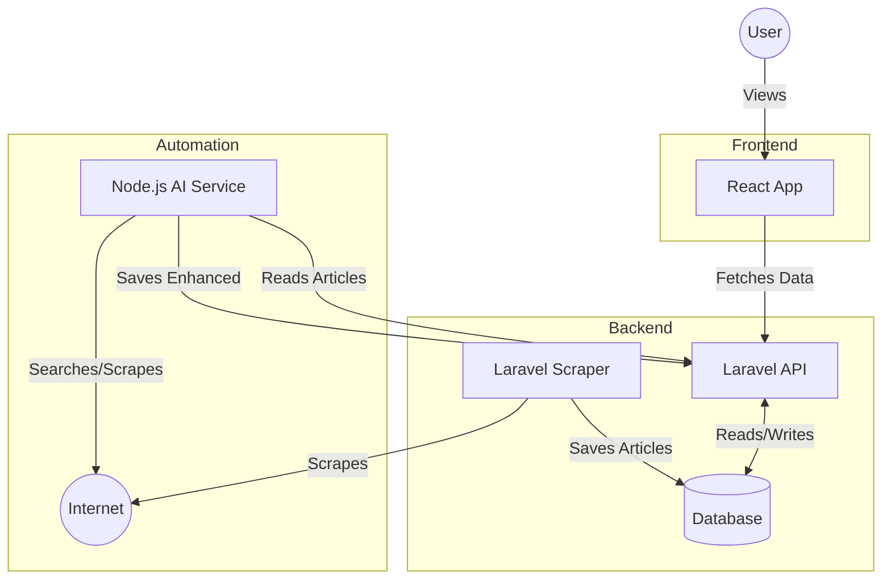

# Laravel Scraper & AI Automation Project

This project simulates a full content enhancement pipeline: Scraping -> AI Rewriting -> Publishing -> Frontend Display.

## 🔗 Live Link
**Frontend (Netlify):** [https://laravel-scraper-0eb7f1.netlify.app](https://laravel-scraper-0eb7f1.netlify.app)
**Backend (Railway):** [https://laravelscraper-production.up.railway.app](https://laravelscraper-production.up.railway.app)

## 🏗️ Architecture / Data Flow



## 📂 Project Structure
- **Root / Backend**: `./` - Contains the main Laravel application (Database, API, Scraper).
- **Node Automation**: `./node_automation` - Script for AI enhancement validation.
- **React Frontend**: `./frontend` - Consumer application for the API.

## Prerequisites
- Docker & Docker Compose
- Node.js & NPM

---

## Phase 1: Laravel Scraper & API

1. **Start the Backend**:
   ```bash
   # In c:\abhijeet\myproject\laravel
   docker compose up -d
   ```

2. **Run Migrations**:
   ```bash
   docker compose exec app php artisan migrate
   ```

3. **Run the Scraper**:
   Fetches the 5 oldest blog posts from BeyondChats.
   ```bash
   docker compose exec app php artisan scrape:blogs
   ```

4. **Verify API**:
   Open [http://localhost:8000/api/articles](http://localhost:8000/api/articles)

---

## Phase 2: Node.js Automation (AI)

1. **Setup Env**:
   Ensure `node_automation/.env` has your `OPENAI_API_KEY` (Optional for Mock Mode).

2. **Run the Script**:
   Fetches an article from API, "Enhances" it, and saves it back.
   ```bash
   cd node_automation
   npm install
   node index.js
   ```

---

## Phase 3: React Frontend

1. **Start the Frontend**:
   ```bash
   cd frontend
   npm install
   npm run dev
   ```

2. **View the App**:
   Open [http://localhost:5173](http://localhost:5173).
   - You will see "Original" articles from Phase 1.
   - You will see "AI Enhanced" articles from Phase 2.
